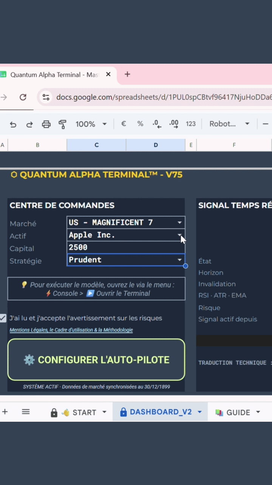

# ⚡ Quantum Alpha Terminal (QUANTIX)


**Quantum Alpha Terminal (QUANTIX)** est une infrastructure logicielle B2B d'analyse financière quantitative développée par **VoltVer**. 

Conçu pour contourner les limitations des terminaux classiques, ce projet hybride déploie un moteur algorithmique haute performance sur le Cloud (Node.js / Vercel) et le connecte de manière sécurisée à une interface utilisateur familière hébergée sur l'environnement Google Workspace (Google Apps Script).

---

<p align="center">
  
</p>

## 🏗️ Architecture du Système

L'infrastructure est modélisée selon une approche microservices, garantissant une scalabilité maximale et la protection absolue de la propriété intellectuelle (le code source de l'algorithme n'étant jamais exposé côté client).

### 1. Back-End Serverless (Moteur Quantitatif)
* **Stack :** Node.js, Express.js, Hébergement Vercel.
* **Fonction :** Récupération asynchrone des flux de marché via l'API Yahoo Finance, nettoyage des séries temporelles et exécution du moteur de backtest (MOC Execution).
* **Algorithmique :** Calcul vectoriel des indicateurs (EMA, RSI, ATR), simulation des pénalités de friction (Slippage, Overnight Fees) et calcul des métriques de risque (Sharpe Ratio, Max Drawdown, Calmar Ratio).
* **Sécurité :** Endpoint protégé par authentification par jeton (`x-quantum-api-key`).

### 2. Front-End Client (Terminal Headless)
* **Stack :** Google Apps Script (JavaScript V8), HTML, CSS, Google Sheets API.
* **Fonction :** Interface utilisateur (UI) sous forme de tableau de bord institutionnel et Sidebar interactive.
* **Orchestration :** Gestion des appels asynchrones (AJAX) vers l'API Vercel, manipulation avancée du DOM Google Sheets (purges silencieuses, injection de données brutes) et création dynamique de Triggers (Cron jobs) pour la fonctionnalité "Auto-Pilote".

### 3. Gestion des Accès (SaaS License Server)
* **Stack :** Google Apps Script (Déploiement Web App), JSON.
* **Fonction :** API de vérification des droits (DRM). Gère l'authentification des clés de licence uniques, le mappage des adresses e-mail et la résolution des privilèges (forfaits `STANDARD` vs `PRO`).
* **Intégration :** Synchronisation Webhook avec Make.com et Gumroad pour le provisioning automatisé.

---

## 📦 Structure du Répertoire

```text
QUANTIX-Terminal/
 ├── backend-vercel/               # Infrastructure de calcul distant
 │   ├── server.js                 # Routeur API, gestion CORS et requêtes historiques
 │   ├── engine.js                 # Moteur de backtest, filtres et signaux
 │   └── package.json              # Dépendances (express, yahoo-finance2, cors)
 ├── frontend-gcp/                 # Interface Utilisateur et Logique Client
 │   ├── Code.gs                   # Fonctions globales et requêtes HTTP sécurisées
 │   ├── Sidebar.html              # Vue latérale de contrôle
 │   ├── AutomationModal.html      # Vue modale pour le paramétrage Auto-Pilote
 │   ├── Onboarding.html           # Vue de démarrage rapide
 │   └── Appscript.json            # Manifeste OAuth et dépendances
 ├── local-bridge/                 # Connecteur pour le tableur client
 │   └── Bridge.gs                 # Fonctions passerelles et gestion des autorisations
 └── license-server/               # Serveur autonome de gestion des abonnements
     └── LicenseManager.gs         # Algorithme de vérification et de restriction


